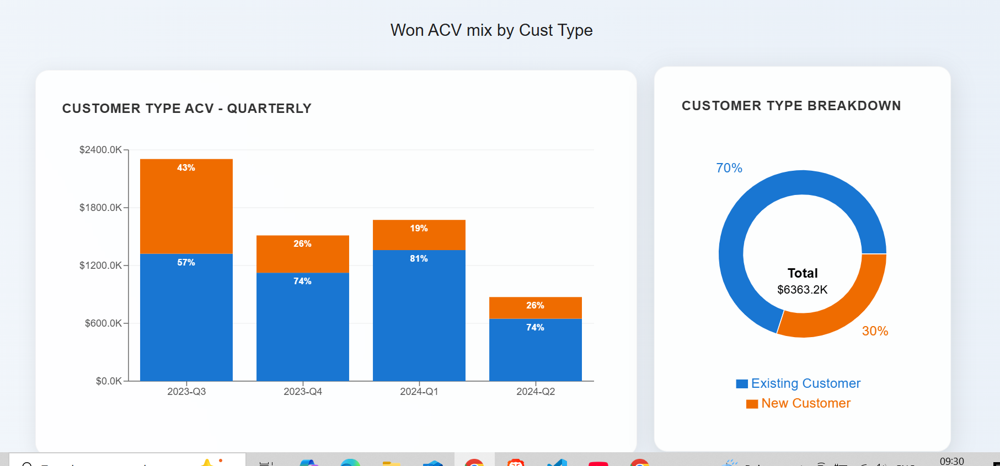
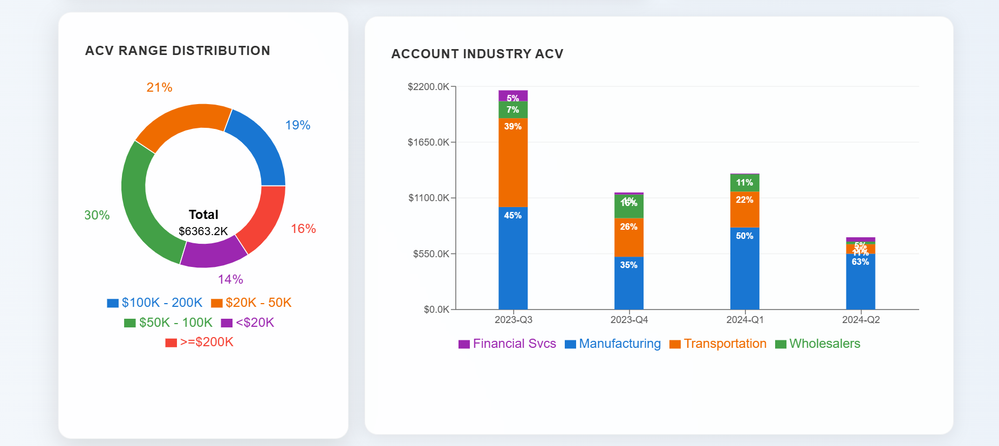
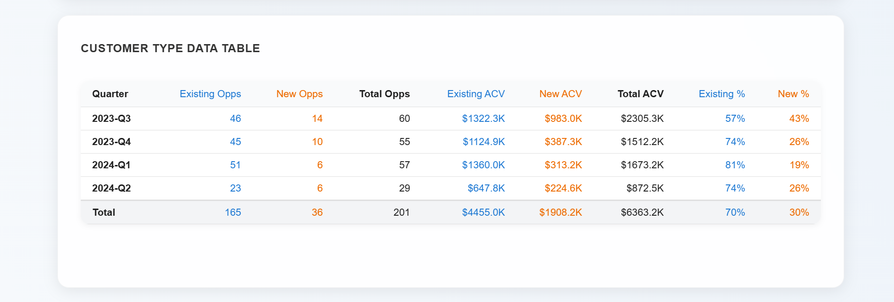

## 📸 Screenshots & Visuals

The following screenshots cover all six core visualizations in the dashboard:

### 1. Customer Type ACV Overview  
  
Displays:
- A stacked bar chart showing quarterly ACV split by **New vs Existing Customers**.
- A donut chart summarizing the total ACV mix across customer types.

These visuals help track customer conversion trends over time.

---

### 2. ACV Range & Industry Distribution  
  
Includes:
- A donut chart showing ACV contribution by deal size (e.g., <$20K, $50K–$100K, >=$200K).
- A stacked bar chart representing quarterly ACV across industries like **Manufacturing** and **Transportation**.

Helps analyze deal size distribution and top-performing industries.

---

### 3. Team ACV Performance  
  
Grouped bar chart showing quarterly ACV breakdown by sales team:
- Regions include **North America**, **Asia Pac**, **Europe**, etc.
- Useful for comparing regional or team-based performance.

---

### 4. Customer Type Data Table  
  
A structured table with:
- Opportunity count and ACV per customer type and quarter.
- Totals and percentage contributions.
- Designed for validation and executive summaries.

---

📁 All screenshots are stored in the `/screenshots` directory and can be referenced for demos or portfolio presentations.
