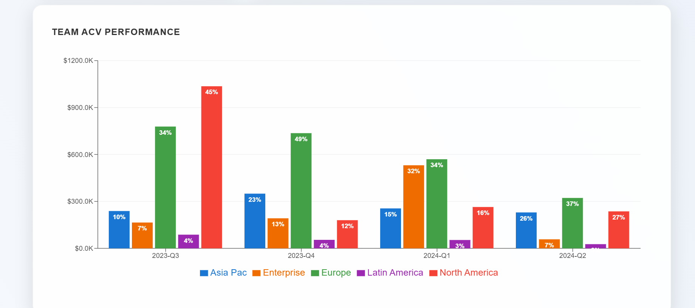

## 📊 Dashboard Screenshots

Here are key visualizations from the ACV analytics dashboard, showcasing customer and revenue insights over time:

---

### 1. Customer Type ACV (Quarterly)

Displays stacked bars comparing **existing** vs **new customer ACV** across each quarter. Helps track how customer contributions shift over time.

---

### 2. Customer Type Breakdown (Donut)

A donut chart showing the **proportional ACV distribution** between new and existing customers. Useful for quick summary-level insights.

---

### 3. Account Industry ACV

Stacked bar chart representing **ACV contribution by industry** over quarters. Ideal for identifying top-performing industries and market trends.

---

### 4. Team ACV Performance

Grouped bar chart comparing **ACV generated by each team** across multiple quarters. Useful for evaluating team performance and identifying leaders.

---

📁 All screenshots are stored in the `/screenshots` directory and can be referenced for demos or portfolio presentations.
